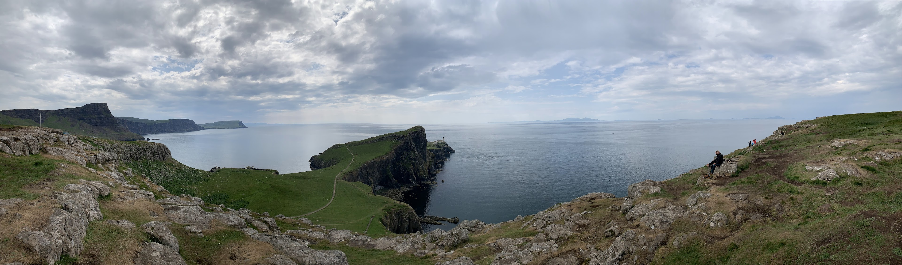

# Joe's Angular Sandbox

This is a collection of personal projects I created when learning Angular using Angular version 17.3.0.

## Hosting

The site can be found on Github Pages at [https://joebouchard.github.io/angular-sandbox/](https://joebouchard.github.io/angular-sandbox/)

## Projects

### Zip Code Finder
A small application that displays the geographical position of a zip code on a map. It utilizes the [Zippopotam](https://api.zippopotam.us/) api to fetch the locations and Leaflet with Open Street Maps to display it on the page.

### Local Logger
Maintains and displays all local log events created by the application

## Muse
The styling of the site is based on my and my wife's recent trip to the Isle of Skye in Scotland. The general palette is a base of light gray with primary green and secondary blue. 

